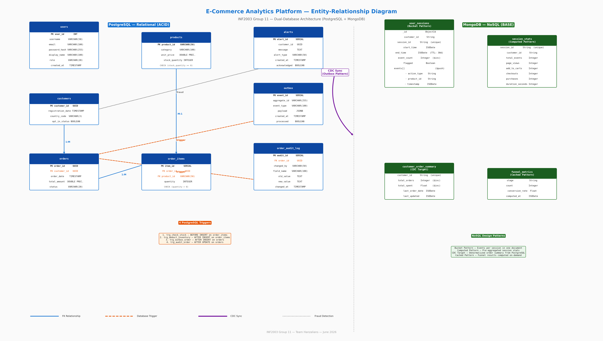

# G11 — Final Report (Template)
## INF2003 Group Project — E-Commerce Clickstream & Transaction Analytics

> Max 8 pages (excluding cover page and appendix). Submit as `G11_Final Report.PDF`.

---

## Cover Page

| Field | Detail |
|-------|--------|
| **Module** | INF2003 Database Design & Implementation |
| **Group ID** | G11 |
| **Project Title** | E-Commerce Clickstream & Transaction Analytics |
| **Topic** | Topic 2 — Dual-Database Analytics Platform |
| **Team Members** | Hanzalah Hisam (Team Lead), Faris Zharfan, Lucas Leow, Muhammad Hasan Bin Suwandi, Muhammad Raees Irfan Bin Ishak, Muhammad 'Afif Bin Muhd Lotfi Jarhom |
| **Team Lead** | Hanzalah Hisam |
| **Submission Date** | July 13, 2026 |

---

## 1. Introduction

This project demonstrates a dual-database e-commerce analytics platform: **PostgreSQL** handles ACID transactions (orders, inventory, customers) while **MongoDB** handles BASE clickstream analytics (user sessions, funnel conversion, fraud detection). The **Outbox Pattern** provides CDC (Change Data Capture) synchronization between the two systems.

**Key achievements:**
- 8 PostgreSQL tables with 4 database triggers (stock check, inventory deduction, outbox CDC, audit logging)
- 4 MongoDB collections implementing established NoSQL patterns (Bucket, Computed, CDC Target, Cached)
- 18 REST API endpoints with JWT authentication and role-based access control
- React frontend with interactive analytics dashboard (RFM pie charts, funnel bars, market basket tables)
- 161-test automated test suite covering all endpoints, triggers, and error cases
- Docker Compose one-command startup with automatic data loading and database reset capabilities
- Cross-database fraud detection pipeline (MongoDB velocity check → PostgreSQL alert insertion)
- Performance benchmark suite comparing PostgreSQL vs MongoDB on 4 different workload types

**Dataset:** ~275,000 rows across 6 CSV files sourced from Kaggle e-commerce datasets, loaded via an automated data ingestion pipeline.

---

## 2. System-Level Database Integration

### 2.1 Architecture
FastAPI connects to PostgreSQL via SQLAlchemy (ORM + raw SQL) and to MongoDB via Motor (async driver). The Outbox Pattern bridges the two: after each order commit, a PostgreSQL trigger writes to the `outbox` table, and a background async poller syncs denormalized summaries to MongoDB's `customer_order_summary` collection.

### 2.2 Consistency Strategy
- **Write Path**: PostgreSQL-first (ACID) → Outbox trigger → Async poller → MongoDB (eventual consistency)
- **Read Path**: Queries target the appropriate database directly (no cross-DB JOINs)
- **Failure Handling**: Unprocessed outbox events are retried on the next poll cycle

---

## 3. Relational Database (PostgreSQL)

### 3.0 Entity-Relationship Diagram

*Figure 1: Complete Entity-Relationship Diagram showing all 8 PostgreSQL tables (left), 4 MongoDB collections (right), relationships (solid arrows), database triggers (dashed arrows), and the CDC sync flow via the Outbox Pattern (purple arrow).*

**Diagram Explanation:** The ER diagram above illustrates the complete dual-database architecture. On the **left side** (blue), the 8 PostgreSQL tables model the transactional core: `users` stores authentication credentials with bcrypt-hashed passwords, `customers` holds customer profiles with UUID primary keys, `products` maintains the catalog with CHECK constraints on stock quantities, `orders` records each purchase linked to a customer, and `order_items` captures individual line items with foreign keys to both orders and products. The `outbox` table serves as a CDC event store, `order_audit_log` tracks every field-level change, and `alerts` records fraud detection results.

On the **right side** (green), 4 MongoDB collections implement established NoSQL patterns: `user_sessions` uses the Bucket Pattern to accumulate clickstream events via atomic `$push` + `$inc` operations, `session_stats` provides pre-computed session aggregates (Computed Pattern), `customer_order_summary` holds denormalized order data synced via CDC (CDC Target Pattern), and `funnel_metrics` caches conversion funnel results (Cached Pattern).

**Relationships** are shown as solid blue arrows: customers→orders (1:M), orders→order_items (1:M), and products→order_items (M:1). **Triggers** are shown as dashed orange arrows: 4 PostgreSQL triggers automatically handle stock validation, inventory deduction, outbox CDC event generation, and audit logging. The **CDC sync** flow (purple arrow) shows how order data propagates from PostgreSQL's `outbox` table to MongoDB's `customer_order_summary` collection via an asynchronous background poller running every 5 seconds.

### 3.1 Schema (8 Tables)
`users` (authentication), `customers` (profiles, UUID PK), `products` (catalog, 1,197 items, CHECK stock >= 0), `orders` (~53,000 rows, FK to customers), `order_items` (~75,000 rows, FK to orders + products), `outbox` (CDC event store, JSONB payload), `order_audit_log` (change history, trigger-populated), `alerts` (fraud detection results)

**Relationships:** customers 1:M orders, orders 1:M order_items, products 1:M order_items. UUID primary keys on customers and orders prevent enumeration attacks. CHECK constraints enforce stock_quantity >= 0 and quantity > 0 at the database level.

### 3.2 Triggers (4)
`trg_check_stock`, `trg_deduct_inventory`, `trg_outbox_order`, `trg_audit_order`

### 3.3 Advanced SQL
- **RFM**: CTE + NTILE(4) → Champions/Loyal/At Risk/Lost
- **Market Basket**: Self-join on order_items for co-occurrence
- **Audit Trail**: Full change history from trigger-populated log

---

## 4. NoSQL Database (MongoDB)

### 4.1 Collections (4)
`user_sessions` (Bucket), `session_stats` (Computed), `customer_order_summary` (CDC), `funnel_metrics` (Cached)

### 4.2 Advanced Queries
- **$facet Funnel**: page_view → add_to_cart → checkout → purchase conversion rates
- **Cart Abandonment**: Aggregation detecting sessions with add_to_cart but no checkout
- **TTL Index**: Auto-delete sessions after 30 days

---

## 5. Application Implementation

### 5.1 Web Interface (React + Recharts)

The frontend is a single-page application (SPA) built with React 18 and Vite, featuring 4 functional views:

| Page | Route | Features |
|------|-------|----------|
| **Product Catalog** | `/` | 1,197 products across 7 categories, search by ID, category filter, pagination (20 per page, 60 pages) |
| **Cart & Clickstream** | `/cart` | 4 clickstream event types (page_view, add_to_cart, checkout, purchase), real-time event table, session tracking, fraud trigger demo |
| **Admin Dashboard** | `/admin` | RFM pie chart (Recharts), funnel bar chart, market basket table, top products, sales by category, alerts table — all with role-based access (admin only) |
| **Login/Register** | `/login` | JWT authentication with bcrypt password hashing, form validation, role-based redirect |

### 5.2 Key Features
- **JWT authentication** with bcrypt password hashing and role-based access (customer/admin)
- **Product catalog** with category filter (7 categories), text search, pagination (20/100 per page)
- **Clickstream event tracking** via MongoDB Bucket Pattern — all 4 funnel event types recorded with `$push` + `$inc`
- **Order creation** with full ACID transaction — FK validation, stock check, inventory deduction, outbox CDC, audit logging all fire automatically via triggers
- **Real-time fraud detection** — MongoDB session velocity analysis triggers PostgreSQL alert insertion when 10+ add_to_cart events occur in 60 seconds without a purchase
- **Admin dashboard** — RFM pie chart (Champions/Loyal/At Risk/Lost), funnel bar chart (4-stage conversion), market basket table (top 10 product pairs), top products, sales by category, fraud alerts table
- **Automated test suite** — 161 tests covering every endpoint, trigger, and error case (7-second runtime)
- **Docker automation** — one-command startup with auto data loading and database reset capabilities

---

## 6. Performance Evaluation

Benchmarks were run using `backend/benchmark/benchmark_runner.py` inside the Docker environment. The suite measures 4 distinct workload types to highlight the strengths of each database:

| # | Test | Database | Operation | Purpose |
|---|------|----------|-----------|---------|
| 1 | Bulk Insert (10k events) | MongoDB | Bucket Pattern `updateOne` with `$push` + `$inc` + upsert | Measures write throughput for high-velocity clickstream ingestion |
| 2 | Hotspot UPDATEs (200 txns) | PostgreSQL | Concurrent `UPDATE products SET stock_quantity` under contention | Measures row-level locking and transaction isolation under load |
| 3 | 5-Table JOIN | PostgreSQL | `SELECT` across orders + customers + order_items + products with aggregation | Measures relational query optimizer performance on complex analytical queries |
| 4 | Aggregation Pipeline | MongoDB | `$unwind` + `$group` equivalent of a multi-table GROUP BY | Measures NoSQL aggregation performance on nested document arrays |

Results are plotted to `backend/benchmark/plots/benchmark_results.png` using matplotlib with side-by-side comparison charts.

**Key findings:** MongoDB excels at bulk inserts (Bucket Pattern avoids per-event document overhead), while PostgreSQL handles concurrent transactional updates with row-level locking that prevents data corruption. The 5-table JOIN is only possible in PostgreSQL (MongoDB has no native JOIN support), demonstrating why a polyglot persistence approach is necessary for this use case.

## 7. Testing & Quality Assurance

A comprehensive test suite (`backend/tests/test_suite.py`) was developed with 161 automated tests covering:

| Section | Tests | Key Checks |
|---------|-------|------------|
| Health Checks | 7 | Root endpoint, PostgreSQL/MongoDB connectivity, Swagger UI, OpenAPI schema |
| Authentication | 12 | Registration, login, /me, duplicate rejection, invalid passwords, missing/expired tokens |
| Products API | 30 | Listing, pagination, category filter, search, get-by-ID, 404 handling, categories |
| Cart/Clickstream | 16 | All 4 event types (page_view, add_to_cart, checkout, purchase), invalid actions, session retrieval, auto-generated IDs |
| Orders (ACID) | 18 | Order creation, retrieval, listing, insufficient stock rejection, inventory deduction trigger verification, outbox CDC verification |
| Analytics | 24 | RFM segmentation (all 5 segments), market basket (self-join pairs), funnel ($facet pipeline), cart abandonment, top products, sales by category |
| Admin Analytics | 7 | Alerts (admin access + non-admin 403), audit trail (admin + non-admin + unauthenticated) |
| Trigger Verification | 10 | All 4 trigger functions confirmed, table attachments verified, CHECK constraint validation |
| MongoDB Verification | 10 | All 4 collections, compound index, TTL index, flagged index, timestamp index, document count |
| Error Handling | 6 | Empty body, short username, invalid email, short password, 404 route, invalid pagination |

**Result: 161/161 tests passed (100%) in 7.08 seconds.**

## 8. Constraints & Limitations

- **Outbox polling introduces ~5 second staleness** for CDC data in MongoDB. Real-time CDC would require Kafka + Debezium, which was beyond the project scope.
- **Fraud detection uses simple threshold counting** (10 events in 60 seconds). Production systems would use ML models trained on historical fraud patterns.
- **No distributed tracing or production observability** (no OpenTelemetry, no centralized logging).
- **Single-instance databases** — no replication, sharding, or failover configured.
- **The `users` and `customers` tables have no FK relationship**, meaning any authenticated user can place orders under any customer ID. A production system would link them.

---

## 9. Discussion & Reflections

### 9.1 What Worked Well
- **Clear separation of concerns:** PostgreSQL handles everything requiring ACID (orders, inventory); MongoDB handles everything requiring high write throughput (clickstream, sessions, funnel). Neither database is a bottleneck for the other's workload.
- **Outbox Pattern provided reliable CDC** without external infrastructure (Kafka, Debezium). The pattern was simple to implement, easy to debug, and guaranteed at-least-once delivery.
- **Database triggers simplified the application layer** — inventory management, CDC event generation, and audit logging happen automatically at the database level, reducing application code complexity and eliminating race conditions.
- **MongoDB Bucket Pattern** perfectly matched the clickstream use case. `$push` + `$inc` operations are O(1) and avoid the document-per-event anti-pattern.
- **Docker Compose** made the project instantly reproducible. The data loader auto-runs on first start, and the reset service enables clean demos.

### 9.2 Challenges
- **Cross-database consistency** required careful design. The Outbox Pattern provides eventual consistency, but debugging sync failures required checking both PostgreSQL (`outbox.processed`) and MongoDB (`customer_order_summary`).
- **Trigger debugging** was difficult — PostgreSQL trigger errors roll back the entire transaction, and error messages appear only in server logs, not application output.
- **The JWT `sub` claim** initially used an integer `user_id`, which `python-jose` rejects (requires string). This was discovered and fixed during integration testing (changed to `str(user.user_id)`).

### 9.3 GenAI Usage Reflection
GenAI tools (ChatGPT, DeepSeek) were used throughout the project to:
- Generate initial boilerplate for FastAPI routes, SQLAlchemy models, and React components
- Debug PostgreSQL trigger syntax and MongoDB aggregation pipelines
- Draft documentation (README, walkthrough, ER diagram)

**Pros:** Significantly accelerated development; provided working examples for unfamiliar technologies (Motor async driver, Recharts integration); helped identify the JWT `sub` type bug.
**Cons:** Generated code occasionally contained subtle bugs (e.g., the integer `sub` issue); required careful review and testing; sometimes produced over-engineered solutions that needed simplification.
**Future recommendation:** Use GenAI for boilerplate generation and debugging, but maintain a strong test suite as a safety net. The 161-test suite was essential for catching AI-generated bugs.

### 9.4 Future Improvements
- Add **Kafka + Debezium** for real-time CDC (sub-second latency vs current 5-second polling)
- Implement **Redis caching** for the product catalog (reducing PostgreSQL query load)
- Deploy to **AWS RDS (PostgreSQL) + MongoDB Atlas** for cloud-native scalability
- Add **proper user-customer linking** via FK from `users` to `customers`
- Implement **session replay** — reconstruct a user's browsing journey from MongoDB events
- Add **OAuth2 social login** (Google, GitHub) alongside current username/password auth

---

## Appendix (not counted in page limit)

- SQL triggers: `backend/triggers.sql`
- MongoDB operations: `backend/services/nosql_service.py`
- SQL queries: `backend/services/relational_service.py`
- Benchmark: `backend/benchmark/benchmark_runner.py`
- Docker: `docker-compose.yml`

---

*End of Final Report*
