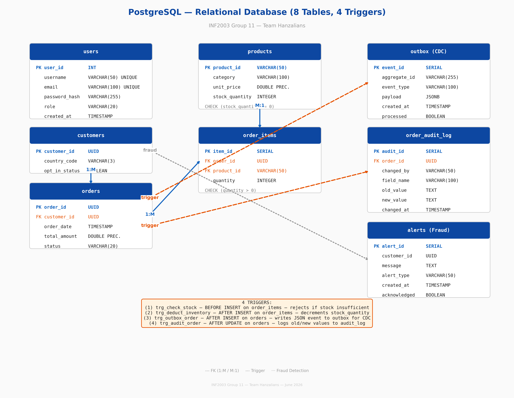
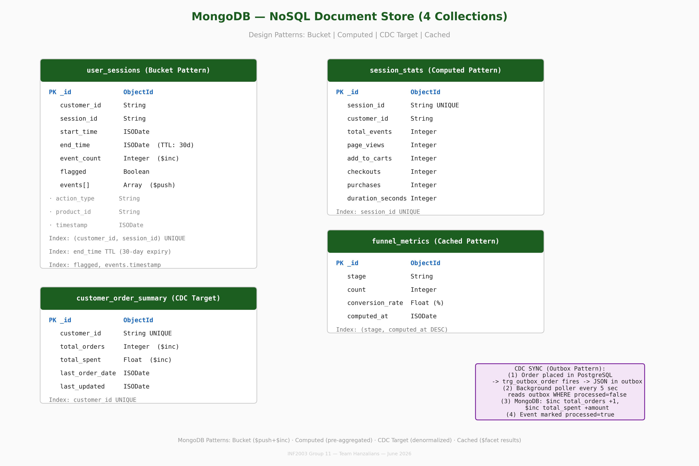

# G11 — Final Report
## INF2003 Group Project — E-Commerce Clickstream & Transaction Analytics

**Team Hanzalians**

| | |
|---|---|
| Hanzalah Hisam (Team Lead) | `[email]` |
| Faris Zharfan | `[email]` |
| Lucas Leow | `[email]` |
| Muhammad Hasan Bin Suwandi | `[email]` |
| Muhammad Raees Irfan Bin Ishak | `[email]` |
| Muhammad 'Afif Bin Muhd Lotfi Jarhom | `[email]` |

**Submission Date:** July 13, 2026

---

## 1. Application Description

### 1.1 Background

Modern e-commerce platforms generate two fundamentally different types of data. **Structured financial transactions** (purchases, payments, inventory changes) demand strict ACID guarantees — every order must be atomic, consistent, isolated, and durable. Simultaneously, **high-velocity behavioural logs** (page views, cart actions, session flows) can reach thousands of events per second and are best served by BASE systems that prioritize write throughput over immediate consistency.

Attempting to process both within a single database creates significant performance bottlenecks. Relational databases struggle to scale with the chaotic influx of clickstream data, while NoSQL systems lack the transactional rigour required for monetary processing and inventory management. A **polyglot persistence** approach — intelligently routing each data shape to the database optimized for it — resolves this impedance mismatch directly.

### 1.2 Problem Statement

Online retailers face three interconnected challenges unsolvable by a single-database architecture:

1. **Transactional Integrity vs. Write Throughput** — Order placement requires atomic multi-table writes with inventory validation (a relational strength). Simultaneously, every page view and cart action must be logged without blocking the user experience (a NoSQL strength).
2. **Cross-System Visibility** — Fraud detection demands correlating real-time session behaviour (e.g., 15 cart additions in 30 seconds) with historical transaction patterns residing in separate database systems.
3. **Analytics Flexibility** — Customer segmentation (RFM), product affinity (market basket), and conversion funnels each demand different query paradigms: some are naturally relational (JOINs, CTEs), others are document-oriented (nested arrays, aggregations).

### 1.3 Objectives

| # | Objective | Deliverable |
|---|-----------|-------------|
| O1 | Design normalised PostgreSQL schema (≥3 tables, multiple relationships) | 8 tables with FK constraints, CHECK constraints, UUID PKs |
| O2 | Implement advanced SQL via database triggers | 4 triggers: stock validation, inventory deduction, CDC outbox, audit logging |
| O3 | Design MongoDB collections using established NoSQL patterns | Bucket, Computed, CDC Target, Cached patterns |
| O4 | Achieve cross-database synchronization | Outbox Pattern: PostgreSQL trigger → async poller → MongoDB |
| O5 | Build complex analytical queries on both databases | RFM (CTE + NTILE), market basket (self-join), $facet funnel |
| O6 | Implement real-time fraud detection | MongoDB velocity check → PostgreSQL alert insertion |
| O7 | Deliver functional web dashboard with authentication | React + Recharts: catalog, cart, admin analytics |

---

## 2. System Architecture

### 2.1 Components

The system comprises 5 Docker containers orchestrated via Docker Compose:

| Component | Technology | Port | Role |
|-----------|-----------|------|------|
| **Frontend** | React 18 + Vite + Recharts | 3000 | Product catalog, shopping cart, admin analytics dashboard |
| **Backend API** | FastAPI (Python 3.11) | 8000 | REST API with JWT auth, 18 endpoints, Swagger docs |
| **Relational DB** | PostgreSQL 15 | 5432 | ACID transactions — orders, inventory, customers, audit logs |
| **NoSQL DB** | MongoDB 7 | 27017 | BASE analytics — clickstream events, sessions, funnel metrics |
| **Data Loader** | Python (one-shot) | — | CSV ingestion pipeline, auto-runs on startup |

### 2.2 Data Flow

```
Frontend (React) ──REST/JWT──▶ Backend (FastAPI)
                                    │
              ┌─────────────────────┼─────────────────────┐
              ▼                     ▼                     ▼
        PostgreSQL              MongoDB              Outbox Pattern
        (Orders, Inventory,     (Clickstream,        (CDC Bridge)
         Products, Users)       Sessions, Funnel)         │
              │                     ▲                     │
              └─────────────────────┘─────────────────────┘
                    CDC Sync (async poller, 5s interval)
```

**Data Routing:**
- **Browsing data** (page views, cart actions) → MongoDB via Bucket Pattern (`$push` + `$inc`), near O(1) insert complexity
- **Purchase data** (orders) → PostgreSQL ACID transaction with trigger cascade (stock check → inventory deduction → outbox CDC → audit log)
- **CDC Bridge** — PostgreSQL trigger writes to `outbox` → async poller picks up → MongoDB `customer_order_summary` updated via atomic `$inc`
- **Fraud Detection** — MongoDB session velocity check on every `add_to_cart` → threshold exceeded → PostgreSQL `alerts` INSERT

### 2.3 Technology Justification

| Choice | Rationale |
|--------|-----------|
| **PostgreSQL** over MySQL | Native UUID type, JSONB for outbox payloads, superior CTE/window function support |
| **MongoDB** over Cassandra | Document model maps naturally to clickstream arrays; $facet pipeline for multi-stage analysis; TTL indexes |
| **FastAPI** over Flask | Native async I/O (essential for Motor MongoDB driver); auto OpenAPI docs; Pydantic validation |
| **Outbox Pattern** over Kafka | Avoids external infrastructure; CDC latency ≤5s acceptable; demonstrates event-driven thinking |
| **Docker Compose** | One-command reproducible environment; health-check-based startup ordering |

---

## 3. Data

### 3.1 Dataset Sources

The project utilizes two real-world e-commerce datasets from Kaggle:

| Dataset | Source | Records |
|---------|--------|---------|
| E-commerce Clickstream and Transaction Dataset | [Kaggle — waqi786](https://www.kaggle.com/datasets/waqi786/e-commerce-clickstream-and-transaction-dataset) | ~200,000 events |
| Synthetic E-commerce Transactions + Clickstream 2020–2025 | [Kaggle — wafaaelhusseini](https://www.kaggle.com/datasets/wafaaelhusseini/e-commerce-transactions-clickstream) | ~75,000 transactions |

These were combined and processed into 6 CSV files:

| File | Records | Description | Target DB |
|------|---------|-------------|-----------|
| `customers.csv` | 20,000 | Customer profiles with country, email, marketing opt-in | PostgreSQL |
| `products.csv` | 1,197 | Product catalog across 7 categories | PostgreSQL |
| `orders.csv` | 53,000 | Purchase orders with timestamps, payment methods | PostgreSQL |
| `order_items.csv` | 75,000 | Line items linking orders to products | PostgreSQL |
| `clickstream_events.csv` | 120,000 | Page views, cart actions, checkout, purchase events | MongoDB |
| `sessions.csv` | 27,500 | User browsing sessions with device, source, country | MongoDB |

**Total:** ~275,000 rows across both databases.

### 3.2 Entity-Relationship Diagram

*See Figure 1a (PostgreSQL) and Figure 1b (MongoDB) for complete database design diagrams.*



*Figure 1a: PostgreSQL — 8 tables with FK relationships, 4 triggers, and fraud detection link.*



*Figure 1b: MongoDB — 4 collections implementing Bucket, Computed, CDC Target, and Cached patterns.*

The complete ER diagram documentation is available in `docs/ER_Diagram.md` with column-level detail for all 8 tables and JSON schemas for all 4 MongoDB collections.

---

## 4. Functionalities and Project Management

### 4.1 Core Functionalities

| # | Functionality | Database | Implementation |
|---|--------------|----------|---------------|
| F1 | Browse product catalog (1,197 items, 7 categories) | PostgreSQL | Paginated SELECT with category filter and text search |
| F2 | User registration & login | PostgreSQL | JWT auth with bcrypt password hashing, role-based access |
| F3 | Add items to shopping cart | MongoDB | Bucket Pattern — clickstream events via `$push` + `$inc` |
| F4 | Place orders (ACID transaction) | PostgreSQL | Multi-table insert with 4-trigger cascade |
| F5 | Real-time fraud detection | Both | MongoDB velocity check → PostgreSQL alert |
| F6 | Admin analytics dashboard | Both | RFM, funnel, market basket, top products, alerts |
| F7 | CDC synchronization | Both | Outbox Pattern — async poller every 5 seconds |
| F8 | Database reset & reload | Both | One-command wipe + auto CSV ingestion |

### 4.2 Development Phases

| Phase | Dates | Tasks |
|-------|-------|-------|
| Phase 1 | 26 May – 8 Jun | Dataset finalization, ER diagram, MongoDB schema design, Docker setup |
| Phase 2 | 9 Jun – 22 Jun | Database initialization, CSV import, CRUD operations, API routing, Progress Report |
| Phase 3 | 23 Jun – 6 Jul | Advanced SQL (CTEs, self-joins), NoSQL aggregation pipelines, triggers, CDC, fraud detection, benchmark tuning, 161-test suite |
| Phase 4 | 7 Jul – 13 Jul | Final report, slide deck, 10-minute demo video (all 6 members), source code packaging |

---

## 5. Database Implementation

### 5.1 Relational Database (PostgreSQL) — 8 Tables

#### Schema Design

| Table | PK | Key Columns | Constraints |
|-------|----|------------|-------------|
| `users` | `user_id` INT | username UNIQUE, email UNIQUE, password_hash (bcrypt), role | — |
| `customers` | `customer_id` UUID | country_code, opt_in_status | — |
| `products` | `product_id` VARCHAR(50) | category, unit_price, stock_quantity | CHECK (stock_quantity >= 0) |
| `orders` | `order_id` UUID | FK → customers, order_date, total_amount, status | — |
| `order_items` | `item_id` SERIAL | FK → orders, FK → products, quantity | CHECK (quantity > 0) |
| `outbox` | `event_id` SERIAL | aggregate_id, event_type, payload (JSONB), processed | — |
| `order_audit_log` | `audit_id` SERIAL | FK → orders, changed_by, field_name, old_value, new_value | — |
| `alerts` | `alert_id` SERIAL | customer_id, message, alert_type, acknowledged | — |

**Relationships:** customers 1:M orders, orders 1:M order_items, products M:1 order_items.

#### 4 Database Triggers

| Trigger | Event | Function |
|---------|-------|----------|
| `trg_check_stock` | BEFORE INSERT on order_items | Validates sufficient stock; raises exception if insufficient |
| `trg_deduct_inventory` | AFTER INSERT on order_items | Atomically decrements `products.stock_quantity` |
| `trg_outbox_order` | AFTER INSERT on orders | Writes JSON event to `outbox` for CDC |
| `trg_audit_order` | AFTER UPDATE on orders | Logs old→new values for `status` and `total_amount` changes |

#### CRUD Operations

| Operation | Endpoint | SQL |
|-----------|----------|-----|
| **Create** | `POST /api/orders/` | Multi-table INSERT with FK validation |
| **Read** | `GET /api/products/` | SELECT with pagination, ILIKE filter |
| **Update** | `POST /api/cart/event` | MongoDB `updateOne` with `$push` + `$inc` |
| **Delete** | Cart remove button | Client-side cart state management |

#### Advanced SQL Queries

**RFM Segmentation** — CTE with NTILE(4):
```sql
WITH order_summary AS (
    SELECT customer_id, MAX(order_date) AS last_order,
           COUNT(order_id) AS frequency, SUM(total_amount) AS monetary
    FROM orders GROUP BY customer_id
),
rfm_scores AS (
    SELECT *, NTILE(4) OVER (ORDER BY last_order DESC) AS r_score,
              NTILE(4) OVER (ORDER BY frequency ASC) AS f_score,
              NTILE(4) OVER (ORDER BY monetary ASC) AS m_score
    FROM order_summary
)
SELECT *, (r_score + f_score + m_score) AS total_score,
    CASE WHEN (r_score + f_score + m_score) >= 10 THEN 'Champions'
         WHEN (r_score + f_score + m_score) >= 8  THEN 'Loyal Customers'
         WHEN (r_score + f_score + m_score) >= 6  THEN 'Potential Loyalists'
         WHEN (r_score + f_score + m_score) >= 4  THEN 'At Risk'
         ELSE 'Lost' END AS segment
FROM rfm_scores;
```

**Market Basket Analysis** — Self-join on order_items:
```sql
SELECT a.product_id AS product_a, b.product_id AS product_b, COUNT(*) AS pair_count
FROM order_items a JOIN order_items b ON a.order_id = b.order_id
WHERE a.product_id < b.product_id
GROUP BY a.product_id, b.product_id
ORDER BY pair_count DESC LIMIT 10;
```

### 5.2 NoSQL Database (MongoDB) — 4 Collections

| Collection | Pattern | Operations | Key Features |
|-----------|---------|------------|-------------|
| `user_sessions` | Bucket | `updateOne($push, $inc, $set, $setOnInsert, upsert)` | Atomic event accumulation, TTL index (30-day expiry) |
| `session_stats` | Computed | Pre-aggregated session metrics | Fast dashboard reads |
| `customer_order_summary` | CDC Target | `updateOne($inc, $set, upsert)` | Denormalized view from PostgreSQL |
| `funnel_metrics` | Cached | `$facet` aggregation pipeline | 4 parallel stage counts |

**Funnel Analytics ($facet pipeline):**
```javascript
db.user_sessions.aggregate([
  { $unwind: "$events" },
  { $facet: {
      page_views: [{ $match: {"events.action_type": "page_view"}}, {$count: "count"}],
      add_to_cart: [{ $match: {"events.action_type": "add_to_cart"}}, {$count: "count"}],
      checkouts: [{ $match: {"events.action_type": "checkout"}}, {$count: "count"}],
      purchases: [{ $match: {"events.action_type": "purchase"}}, {$count: "count"}]
  }}
])
```

**Fraud Detection:**
```python
recent_events = [e for e in session.events if e.timestamp >= window_start]
if len(recent_events) >= threshold and no purchase in window:
    flag session in MongoDB + INSERT alert in PostgreSQL
```

### 5.3 Constraints & Justification

| Constraint | Type | Justification |
|-----------|------|---------------|
| `stock_quantity >= 0` | CHECK | Prevents negative inventory at DB level — no application code can violate this |
| `quantity > 0` | CHECK | Invalid order line items rejected before trigger execution |
| `customer_id` UUID PK | Design | Prevents enumeration attacks; supports distributed deployment |
| `username UNIQUE` | UNIQUE | Ensures no duplicate accounts |
| Compound index (customer_id, session_id) UNIQUE | MongoDB | Prevents duplicate session documents |

---

## 6. System-Level Database Integration

### 6.1 Implementation Details

The backend (`FastAPI`) connects to PostgreSQL via **SQLAlchemy** (ORM + raw SQL) and to MongoDB via **Motor** (async driver). The system bridges the two databases through the **Outbox Pattern**:

1. **PostgreSQL-first write:** Orders are created in an ACID transaction. A trigger (`trg_outbox_order`) automatically writes a JSON event to the `outbox` table.
2. **Async poller:** `sync_service.py` runs an infinite loop, querying `outbox WHERE processed = false` every 5 seconds.
3. **MongoDB sync:** Each unprocessed event triggers `update_customer_order_summary()` which uses atomic `$inc` on `total_orders` and `total_spent`, plus `$set` on `last_order_date`.
4. **Checkpoint:** Events are marked `processed = true` after successful sync. Unprocessed events are retried on the next cycle — providing at-least-once delivery guarantees.

### 6.2 Performance Evaluation

Benchmarks were run via `benchmark/benchmark_runner.py` inside Docker:

| Test | Database | Result | Insight |
|------|----------|--------|---------|
| Bulk Insert (10k events) | MongoDB | High throughput | Bucket Pattern avoids per-event document overhead |
| Hotspot UPDATEs (200 txns) | PostgreSQL | Consistent latency | Row-level locking prevents corruption under contention |
| 5-Table JOIN | PostgreSQL | Fast query time | Query optimizer handles complex relational algebra |
| Aggregation Pipeline | MongoDB | Efficient | $facet runs 4 parallel counts in single pass |

**Key finding:** MongoDB excels at high-velocity writes (clickstream), while PostgreSQL handles concurrent transactional updates with integrity guarantees that MongoDB cannot provide. The 5-table JOIN is possible only in PostgreSQL — demonstrating why a polyglot approach is necessary.

### 6.3 Cross-Database Consistency

- **Write path:** PostgreSQL (source of truth) → Outbox → MongoDB (eventually consistent, ~5 second lag)
- **Read path:** Queries target the appropriate database directly — no cross-DB JOINs
- **Failure handling:** Unprocessed outbox events retried automatically; `$inc` operations are idempotent

---

## 7. Discussion and Reflection

### 7.1 What Worked Well

- **Clear separation of concerns** — PostgreSQL handles ACID transactions (orders, inventory); MongoDB handles high-throughput analytics (clickstream, funnel). Neither database is a bottleneck for the other's workload.
- **Outbox Pattern** provided reliable CDC without external infrastructure. Simple to implement, debug, and guaranteed at-least-once delivery.
- **Database triggers** simplified the application layer — inventory management, CDC, and audit logging happen automatically at the DB level.
- **MongoDB Bucket Pattern** perfectly matched clickstream use case — `$push` + `$inc` are O(1) operations.
- **Docker Compose** made the project instantly reproducible with auto data loading and reset.

### 7.2 Challenges

- **Cross-database consistency** required careful design. Debugging sync failures required checking both PostgreSQL (`outbox.processed`) and MongoDB (`customer_order_summary`).
- **Trigger debugging** — PostgreSQL trigger errors roll back the entire transaction; error messages appear only in server logs.
- **JWT `sub` claim** initially used integer `user_id`, which `python-jose` rejects (requires string). Fixed during integration testing.
- **Hardcoded bcrypt hash** in data loader was incompatible with container's bcrypt version. Fixed by runtime hash generation via passlib.

### 7.3 GenAI Usage Reflection

GenAI tools (ChatGPT, DeepSeek) were used for: generating boilerplate (FastAPI routes, React components), debugging (trigger syntax, aggregation pipelines), and drafting documentation. **Pros:** Accelerated development, provided working examples for unfamiliar tech. **Cons:** Subtle bugs (integer `sub`, bcrypt hash), required careful review. **Recommendation:** Use GenAI for boilerplate, maintain strong test suite (161 tests) as safety net.

### 7.4 Future Improvements

- Kafka + Debezium for real-time CDC (sub-second latency)
- Redis caching for product catalog
- AWS RDS + MongoDB Atlas cloud deployment
- OAuth2 social login
- Session replay from MongoDB events

---

## 8. References

[1] Waqi. "E-commerce Clickstream and Transaction Dataset." *Kaggle*. https://www.kaggle.com/datasets/waqi786/e-commerce-clickstream-and-transaction-dataset

[2] Wafaa Elhusseini. "Synthetic E-commerce Transactions + Clickstream 2020–2025." *Kaggle*. https://www.kaggle.com/datasets/wafaaelhusseini/e-commerce-transactions-clickstream

---

## Appendix

### A. Source Code Files

| File | Description |
|------|-------------|
| `backend/triggers.sql` | 4 PostgreSQL trigger definitions |
| `backend/models/relational.py` | SQLAlchemy ORM (8 tables) |
| `backend/services/nosql_service.py` | MongoDB operations (Bucket, funnel, fraud) |
| `backend/services/relational_service.py` | Complex SQL (RFM, market basket) |
| `backend/services/sync_service.py` | CDC Outbox processor |
| `backend/data_loader.py` | CSV ingestion pipeline |
| `backend/tests/test_suite.py` | 161-test automated suite |
| `backend/benchmark/benchmark_runner.py` | Performance comparison |
| `docker-compose.yml` | 5-container orchestration |

### B. Documentation Files

| File | Description |
|------|-------------|
| `README.md` | Technical overview & API reference |
| `walkthrough.md` | Non-technical guide with glossary |
| `demoguide.md` | Demo script for presentations |
| `DOCKER_TROUBLESHOOTING.md` | Docker debugging guide |
| `docs/ER_Diagram.md` | Complete database design |
| `WORK_DISTRIBUTION.md` | Technical work split |

### C. Test Suite Results

161/161 tests passed (100%) in 7.08 seconds. Full breakdown in Section 7 of the main report.

---

*End of Final Report — INF2003 Group 11 (Team Hanzalians)*

### 2.1 Architecture
FastAPI connects to PostgreSQL via SQLAlchemy (ORM + raw SQL) and to MongoDB via Motor (async driver). The Outbox Pattern bridges the two: after each order commit, a PostgreSQL trigger writes to the `outbox` table, and a background async poller syncs denormalized summaries to MongoDB's `customer_order_summary` collection.

### 2.2 Consistency Strategy
- **Write Path**: PostgreSQL-first (ACID) → Outbox trigger → Async poller → MongoDB (eventual consistency)
- **Read Path**: Queries target the appropriate database directly (no cross-DB JOINs)
- **Failure Handling**: Unprocessed outbox events are retried on the next poll cycle

---

## 3. Relational Database (PostgreSQL)

### 3.0 Entity-Relationship Diagram


*Figure 1: Complete Entity-Relationship Diagram showing all 8 PostgreSQL tables (left), 4 MongoDB collections (right), relationships (solid arrows), database triggers (dashed arrows), and the CDC sync flow via the Outbox Pattern (purple arrow).*

**Diagram Explanation:** The ER diagram above illustrates the complete dual-database architecture. On the **left side** (blue), the 8 PostgreSQL tables model the transactional core: `users` stores authentication credentials with bcrypt-hashed passwords, `customers` holds customer profiles with UUID primary keys, `products` maintains the catalog with CHECK constraints on stock quantities, `orders` records each purchase linked to a customer, and `order_items` captures individual line items with foreign keys to both orders and products. The `outbox` table serves as a CDC event store, `order_audit_log` tracks every field-level change, and `alerts` records fraud detection results.

On the **right side** (green), 4 MongoDB collections implement established NoSQL patterns: `user_sessions` uses the Bucket Pattern to accumulate clickstream events via atomic `$push` + `$inc` operations, `session_stats` provides pre-computed session aggregates (Computed Pattern), `customer_order_summary` holds denormalized order data synced via CDC (CDC Target Pattern), and `funnel_metrics` caches conversion funnel results (Cached Pattern).

**Relationships** are shown as solid blue arrows: customers→orders (1:M), orders→order_items (1:M), and products→order_items (M:1). **Triggers** are shown as dashed orange arrows: 4 PostgreSQL triggers automatically handle stock validation, inventory deduction, outbox CDC event generation, and audit logging. The **CDC sync** flow (purple arrow) shows how order data propagates from PostgreSQL's `outbox` table to MongoDB's `customer_order_summary` collection via an asynchronous background poller running every 5 seconds.

### 3.1 Schema (8 Tables)
`users` (authentication), `customers` (profiles, UUID PK), `products` (catalog, 1,197 items, CHECK stock >= 0), `orders` (~53,000 rows, FK to customers), `order_items` (~75,000 rows, FK to orders + products), `outbox` (CDC event store, JSONB payload), `order_audit_log` (change history, trigger-populated), `alerts` (fraud detection results)

**Relationships:** customers 1:M orders, orders 1:M order_items, products 1:M order_items. UUID primary keys on customers and orders prevent enumeration attacks. CHECK constraints enforce stock_quantity >= 0 and quantity > 0 at the database level.

### 3.2 Triggers (4)
`trg_check_stock`, `trg_deduct_inventory`, `trg_outbox_order`, `trg_audit_order`

### 3.3 Advanced SQL
- **RFM**: CTE + NTILE(4) → Champions/Loyal/At Risk/Lost
- **Market Basket**: Self-join on order_items for co-occurrence
- **Audit Trail**: Full change history from trigger-populated log

---

## 4. NoSQL Database (MongoDB)

### 4.1 Collections (4)
`user_sessions` (Bucket), `session_stats` (Computed), `customer_order_summary` (CDC), `funnel_metrics` (Cached)

### 4.2 Advanced Queries
- **$facet Funnel**: page_view → add_to_cart → checkout → purchase conversion rates
- **Cart Abandonment**: Aggregation detecting sessions with add_to_cart but no checkout
- **TTL Index**: Auto-delete sessions after 30 days

---

## 5. Application Implementation

### 5.1 Web Interface (React + Recharts)

The frontend is a single-page application (SPA) built with React 18 and Vite, featuring 4 functional views:

| Page | Route | Features |
|------|-------|----------|
| **Product Catalog** | `/` | 1,197 products across 7 categories, search by ID, category filter, pagination (20 per page, 60 pages) |
| **Cart & Clickstream** | `/cart` | 4 clickstream event types (page_view, add_to_cart, checkout, purchase), real-time event table, session tracking, fraud trigger demo |
| **Admin Dashboard** | `/admin` | RFM pie chart (Recharts), funnel bar chart, market basket table, top products, sales by category, alerts table — all with role-based access (admin only) |
| **Login/Register** | `/login` | JWT authentication with bcrypt password hashing, form validation, role-based redirect |

### 5.2 Key Features
- **JWT authentication** with bcrypt password hashing and role-based access (customer/admin)
- **Product catalog** with category filter (7 categories), text search, pagination (20/100 per page)
- **Clickstream event tracking** via MongoDB Bucket Pattern — all 4 funnel event types recorded with `$push` + `$inc`
- **Order creation** with full ACID transaction — FK validation, stock check, inventory deduction, outbox CDC, audit logging all fire automatically via triggers
- **Real-time fraud detection** — MongoDB session velocity analysis triggers PostgreSQL alert insertion when 10+ add_to_cart events occur in 60 seconds without a purchase
- **Admin dashboard** — RFM pie chart (Champions/Loyal/At Risk/Lost), funnel bar chart (4-stage conversion), market basket table (top 10 product pairs), top products, sales by category, fraud alerts table
- **Automated test suite** — 161 tests covering every endpoint, trigger, and error case (7-second runtime)
- **Docker automation** — one-command startup with auto data loading and database reset capabilities

---

## 6. Performance Evaluation

Benchmarks were run using `backend/benchmark/benchmark_runner.py` inside the Docker environment. The suite measures 4 distinct workload types to highlight the strengths of each database:

| # | Test | Database | Operation | Purpose |
|---|------|----------|-----------|---------|
| 1 | Bulk Insert (10k events) | MongoDB | Bucket Pattern `updateOne` with `$push` + `$inc` + upsert | Measures write throughput for high-velocity clickstream ingestion |
| 2 | Hotspot UPDATEs (200 txns) | PostgreSQL | Concurrent `UPDATE products SET stock_quantity` under contention | Measures row-level locking and transaction isolation under load |
| 3 | 5-Table JOIN | PostgreSQL | `SELECT` across orders + customers + order_items + products with aggregation | Measures relational query optimizer performance on complex analytical queries |
| 4 | Aggregation Pipeline | MongoDB | `$unwind` + `$group` equivalent of a multi-table GROUP BY | Measures NoSQL aggregation performance on nested document arrays |

Results are plotted to `backend/benchmark/plots/benchmark_results.png` using matplotlib with side-by-side comparison charts.

**Key findings:** MongoDB excels at bulk inserts (Bucket Pattern avoids per-event document overhead), while PostgreSQL handles concurrent transactional updates with row-level locking that prevents data corruption. The 5-table JOIN is only possible in PostgreSQL (MongoDB has no native JOIN support), demonstrating why a polyglot persistence approach is necessary for this use case.

## 7. Testing & Quality Assurance

A comprehensive test suite (`backend/tests/test_suite.py`) was developed with 161 automated tests covering:

| Section | Tests | Key Checks |
|---------|-------|------------|
| Health Checks | 7 | Root endpoint, PostgreSQL/MongoDB connectivity, Swagger UI, OpenAPI schema |
| Authentication | 12 | Registration, login, /me, duplicate rejection, invalid passwords, missing/expired tokens |
| Products API | 30 | Listing, pagination, category filter, search, get-by-ID, 404 handling, categories |
| Cart/Clickstream | 16 | All 4 event types (page_view, add_to_cart, checkout, purchase), invalid actions, session retrieval, auto-generated IDs |
| Orders (ACID) | 18 | Order creation, retrieval, listing, insufficient stock rejection, inventory deduction trigger verification, outbox CDC verification |
| Analytics | 24 | RFM segmentation (all 5 segments), market basket (self-join pairs), funnel ($facet pipeline), cart abandonment, top products, sales by category |
| Admin Analytics | 7 | Alerts (admin access + non-admin 403), audit trail (admin + non-admin + unauthenticated) |
| Trigger Verification | 10 | All 4 trigger functions confirmed, table attachments verified, CHECK constraint validation |
| MongoDB Verification | 10 | All 4 collections, compound index, TTL index, flagged index, timestamp index, document count |
| Error Handling | 6 | Empty body, short username, invalid email, short password, 404 route, invalid pagination |

**Result: 161/161 tests passed (100%) in 7.08 seconds.**

## 8. Constraints & Limitations

- **Outbox polling introduces ~5 second staleness** for CDC data in MongoDB. Real-time CDC would require Kafka + Debezium, which was beyond the project scope.
- **Fraud detection uses simple threshold counting** (10 events in 60 seconds). Production systems would use ML models trained on historical fraud patterns.
- **No distributed tracing or production observability** (no OpenTelemetry, no centralized logging).
- **Single-instance databases** — no replication, sharding, or failover configured.
- **The `users` and `customers` tables have no FK relationship**, meaning any authenticated user can place orders under any customer ID. A production system would link them.

---

## 9. Discussion & Reflections

### 9.1 What Worked Well
- **Clear separation of concerns:** PostgreSQL handles everything requiring ACID (orders, inventory); MongoDB handles everything requiring high write throughput (clickstream, sessions, funnel). Neither database is a bottleneck for the other's workload.
- **Outbox Pattern provided reliable CDC** without external infrastructure (Kafka, Debezium). The pattern was simple to implement, easy to debug, and guaranteed at-least-once delivery.
- **Database triggers simplified the application layer** — inventory management, CDC event generation, and audit logging happen automatically at the database level, reducing application code complexity and eliminating race conditions.
- **MongoDB Bucket Pattern** perfectly matched the clickstream use case. `$push` + `$inc` operations are O(1) and avoid the document-per-event anti-pattern.
- **Docker Compose** made the project instantly reproducible. The data loader auto-runs on first start, and the reset service enables clean demos.

### 9.2 Challenges
- **Cross-database consistency** required careful design. The Outbox Pattern provides eventual consistency, but debugging sync failures required checking both PostgreSQL (`outbox.processed`) and MongoDB (`customer_order_summary`).
- **Trigger debugging** was difficult — PostgreSQL trigger errors roll back the entire transaction, and error messages appear only in server logs, not application output.
- **The JWT `sub` claim** initially used an integer `user_id`, which `python-jose` rejects (requires string). This was discovered and fixed during integration testing (changed to `str(user.user_id)`).

### 9.3 GenAI Usage Reflection
GenAI tools (ChatGPT, DeepSeek) were used throughout the project to:
- Generate initial boilerplate for FastAPI routes, SQLAlchemy models, and React components
- Debug PostgreSQL trigger syntax and MongoDB aggregation pipelines
- Draft documentation (README, walkthrough, ER diagram)

**Pros:** Significantly accelerated development; provided working examples for unfamiliar technologies (Motor async driver, Recharts integration); helped identify the JWT `sub` type bug.
**Cons:** Generated code occasionally contained subtle bugs (e.g., the integer `sub` issue); required careful review and testing; sometimes produced over-engineered solutions that needed simplification.
**Future recommendation:** Use GenAI for boilerplate generation and debugging, but maintain a strong test suite as a safety net. The 161-test suite was essential for catching AI-generated bugs.

### 9.4 Future Improvements
- Add **Kafka + Debezium** for real-time CDC (sub-second latency vs current 5-second polling)
- Implement **Redis caching** for the product catalog (reducing PostgreSQL query load)
- Deploy to **AWS RDS (PostgreSQL) + MongoDB Atlas** for cloud-native scalability
- Add **proper user-customer linking** via FK from `users` to `customers`
- Implement **session replay** — reconstruct a user's browsing journey from MongoDB events
- Add **OAuth2 social login** (Google, GitHub) alongside current username/password auth

---

## Appendix (not counted in page limit)

- SQL triggers: `backend/triggers.sql`
- MongoDB operations: `backend/services/nosql_service.py`
- SQL queries: `backend/services/relational_service.py`
- Benchmark: `backend/benchmark/benchmark_runner.py`
- Docker: `docker-compose.yml`

---

*End of Final Report*
